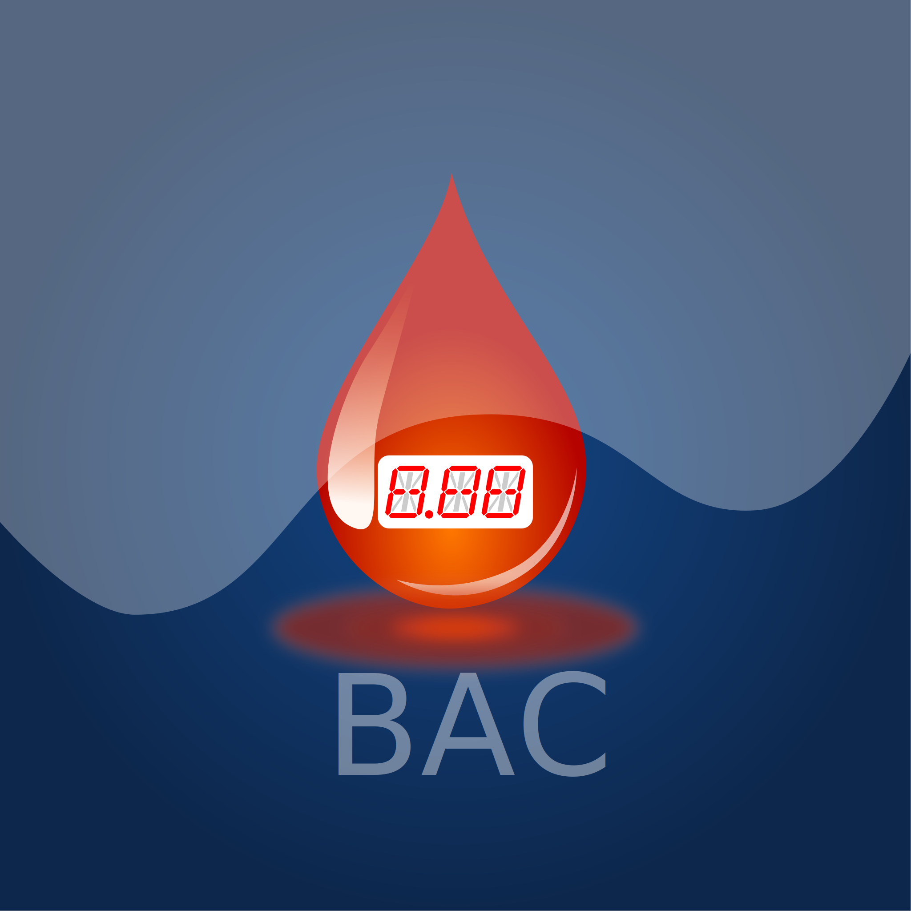
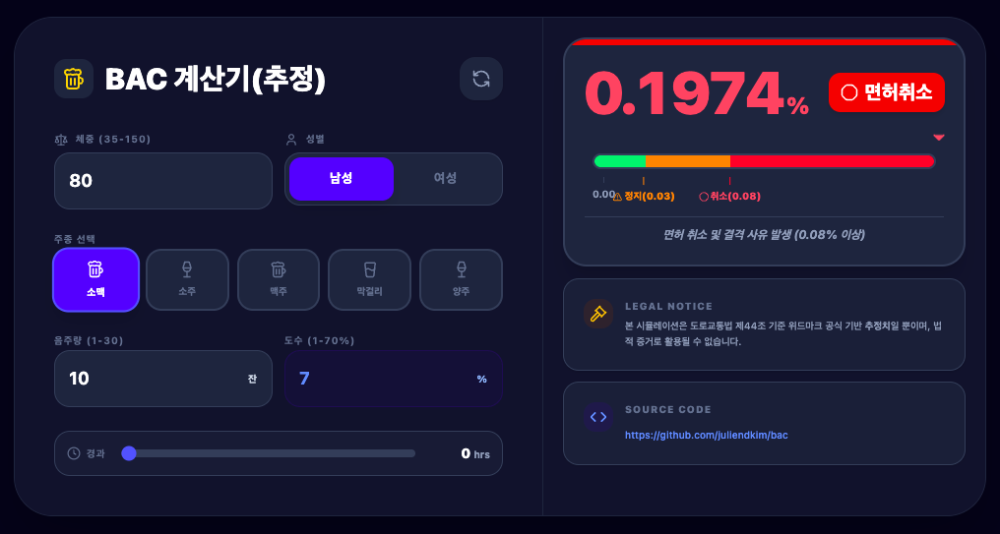
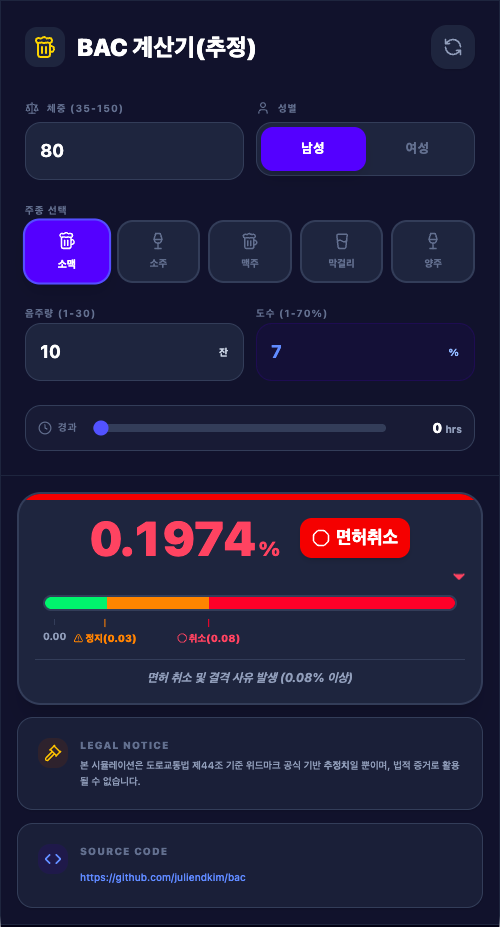

#  BAC (Blood Alcohol Concentration) Calculator

[ 한국어 ](./README.md) | [ English ](./README.en.md)

이 프로젝트는 위드마크(Widmark) 공식을 기반으로 사용자의 성별, 체중, 음주량, 경과 시간을 입력받아 예상 혈중알코올농도(BAC)를 추정해주는 웹 애플리케이션입니다.

> **⚠️ 주의사항:** 본 서비스에서 제공하는 계산 결과는 위드마크 공식에 기반한 **추정치**입니다. 개인의 체질, 음식 섭취 여부 등에 따라 실제 측정값과 다를 수 있으며, 어떠한 법적 증거로도 활용될 수 없습니다. 음주 후에는 절대로 운전대를 잡지 마세요.
<div align="left">
  
  
</div>


## 주요 기능

- **위드마크 공식 기반 계산:** 성별, 체중, 주종, 음주량, 도수, 경과 시간을 고려한 정밀 추정.
- **다양한 주종 지원:** 소맥, 소주, 맥주, 막걸리, 양주 등 기본 프리셋 제공 및 도수 커스텀 가능.
- **실시간 상태 시각화:** BAC 수치에 따른 법적 단계(정상, 훈방, 면허정지, 면허취소)를 색상과 아이콘으로 즉시 표시.
- **인터랙티브 게이지:** 현재 상태를 한눈에 볼 수 있는 직관적인 시각적 게이지 제공.
- **다크 모드 지원:** 사용자 환경에 맞춘 세련된 UI (Tailwind CSS 기반).
- **PWA(Progressive Web App):** 앱처럼 설치하여 오프라인 환경에서도 손쉽게 사용 가능.

## 기술 스택

- **Frontend:** React 19, Lucide React (Icons)
- **Styling:** Tailwind CSS 4
- **Build Tool:** Vite
- **PWA:** Vite Plugin PWA

---

## 설치 및 실행 방법

### 요구 사항
- [Node.js](https://nodejs.org/) (버전 18 이상 권장)
- npm 또는 yarn

### 1. 저장소 복제
```bash
git clone git@github.com:juliendkim/bac.git
cd bac
```

### 2. 의존성 설치
```bash
npm install
```

### 3. 개발 서버 실행
```bash
npm run dev
```
실행 후 브라우저에서 `http://localhost:5173`으로 접속합니다.

### 4. 코드 스타일 검사 (Lint)
```bash
npm run lint
```

### 5. 빌드 및 배포
```bash
npm run build
```
`dist` 폴더에 생성된 정적 파일들을 서버에 배포할 수 있습니다.

---

## 사용 방법

1. **사용자 정보 입력:** 본인의 체중과 성별을 선택합니다.
2. **음주 데이터 선택:** 주종을 선택하고 마신 잔 수를 입력합니다. 필요한 경우 도수(%)를 직접 수정할 수 있습니다.
3. **경과 시간 설정:** 술을 마신 후 지난 시간을 슬라이더로 조절합니다.
4. **결과 확인:** 우측 대시보드에서 예상 BAC 수치와 법적 단속 기준에 따른 상태를 확인합니다.
5. **초기화:** 우측 상단의 새로고침 아이콘을 클릭하여 모든 입력을 초기 상태로 돌릴 수 있습니다.

---

## LEGAL NOTICE (대한민국 도로교통법 기준)

- **0.03% 이상 ~ 0.08% 미만:** 면허 정지 (100일)
- **0.08% 이상:** 면허 취소

---

## 소스코드 (Source Code)

[https://github.com/juliendkim/bac](https://github.com/juliendkim/bac)

---

## 개발 (Created by)

- **김동주** [deekim@cu.ac.kr](mailto:deekim@cu.ac.kr)
- 대구가톨릭대학교 컴퓨터소프트웨어학부

<div align="left">
  
  
</div>

---

## 라이선스
본 프로젝트는 MIT 라이선스 하에 배포됩니다.
